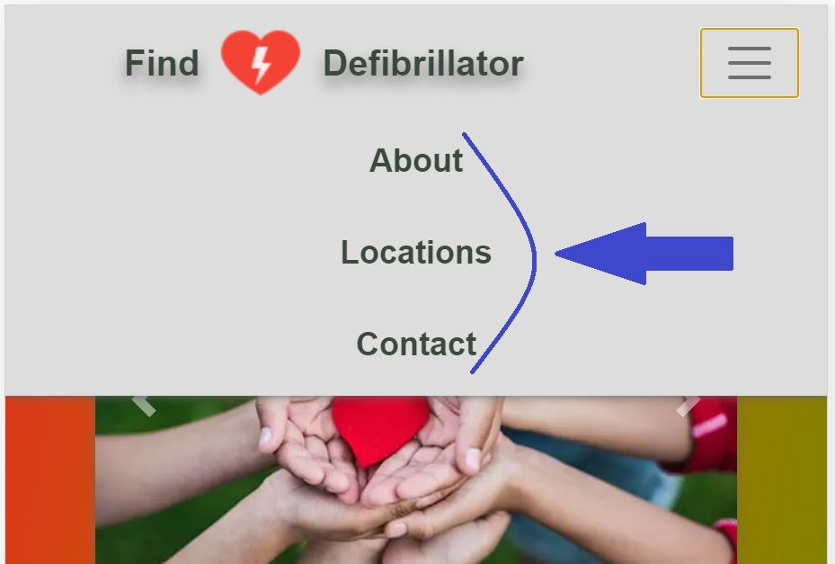
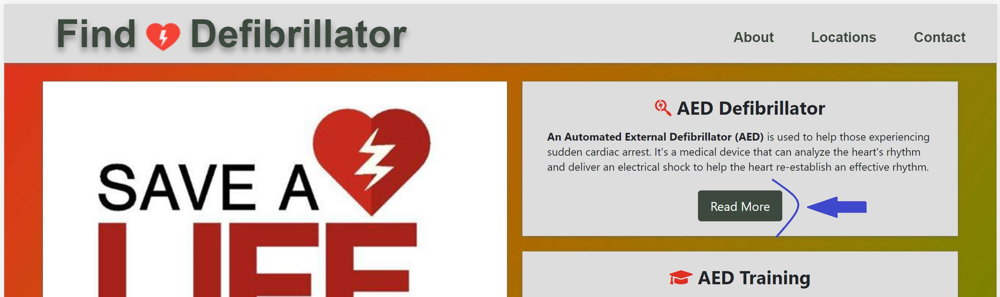
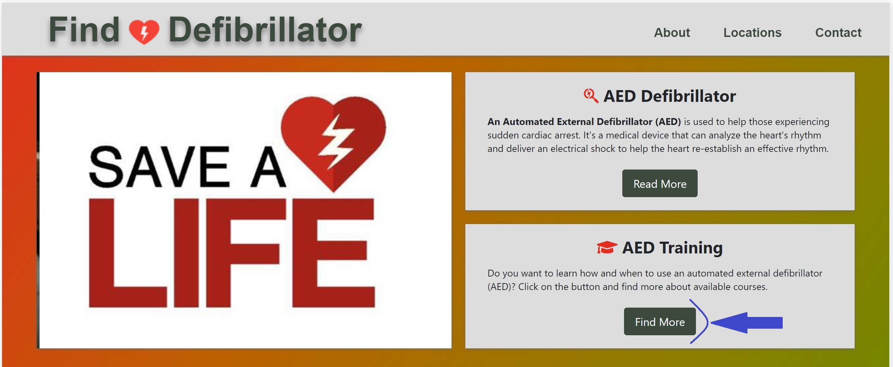
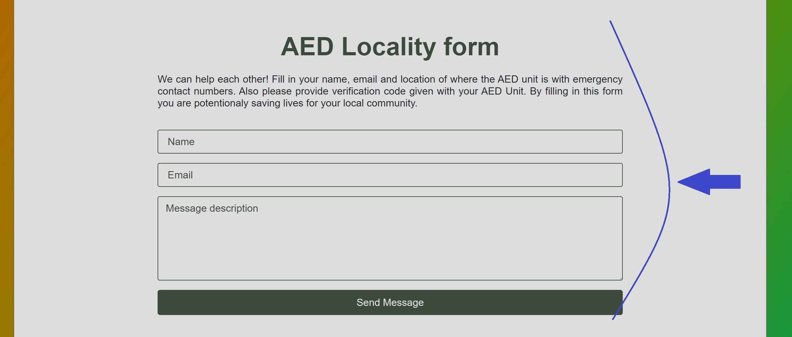

# Find Defibrillator

* [Click here](https://sandra-be.github.io/find_defibrillator/) and view the live project.

# Table of contents

1. [Introduction](#Introduction)
2. [UX](#UX)
   * [Strategy](#Strategy)
      * [Website strategy](#Website-strategy)
      * [Target audience](#Target-audience)
      * [External Visitor's goal's](#External-Visitor's-goal's)
      * [Ideal client](#Ideal-client)
      * [Site Owner's goal's](#Site-Owner's-goal's)
   * [Scope](#Scope)
      * [User stories](#User-stories)
      * [Features](#Features)
      * [Content](#Content)
   * [Structure](#Structure)
      * [Site structure](#Site-structure)
   * [Skeleton](#Skeleton)
      * [Quick sketch](#Quick-sketch)
      * [Wireframes](#Wireframes)
   * [Design](#Design)
      * [Colour scheme](#Colour-scheme)
      * [Fonts](#Fonts)
      * [Media](#Media)
      * [Languages](#Languages)
      * [Technologies Used](#Technologies-Used) 
3. [Completed Live Site](#Completed-Live-Site)
   * [Existing features](#Existing-features) 
   * [Features to Implement in future](#Features-to-Implement-in-future)  
4. [Testing](#Testing)
   * [W3C Validation](#W3C-Validation)
   * [Bugs and Issues](#Bugs-and-Issues)
   * [User stories testing](#User-stories-testing)
   * [Functional testing](#Function-testing)
5. [Google Maps Platform](#Google-Maps-Platform)
   * [Creating API keys](#Creating-API-keys)
   * [Adding the API key to your request](#Adding-the-API-key-to-your-request)
6. [Deployment](#Deployment)
   * [Deploying on GitHub Pages](#Deploying-on-GitHub-Pages)
   * [Forking the Repository](#Forking-the-Repository)
   * [Creating a Clone](#Creating-a-Clone)
7. [Credits](#Credits)
   * [Images and text](#Images-and-text)
   * [Code](#Code)
   * [Helpfull sites](#Helpfull-sites)
   * [Acknowledgements](#Acknowledgements)

# Introduction

I was inspired to create this project after I heard the incident on radio about Christian Eriksen a Danish professional footballer. This set me on the path living in Ireland where vast parts of the country have no immediate access to hospitals or life saving equipment and I wanted to come up with an idea to change that.

This website will be primarily used by the general public to find an AED unit in times of emergency, or to just know where the defibrillator unit is for future reference. Is also set up for community groups, sports centers and local businesses etc. to allow advertisement of the defibrillator for public use with contact information to be available to the public. This website has the capacity to save lifes in rural settings where an emergency teams will take too long to safe a life. The website features more insights about an AED product. 

It's a simple, easy, and understandable website for different age group people which will quicly allow the user to find location of life saving equipment. 

# UX

## Strategy
### Website strategy

* Create online presence
* Promote an AED products
* Provide information about defibrillator
* Links available for product training
* Provide a contact locality form for people
* Provide an opportunity to locate an AED unit
* Provide a social link for product purchase

### Target audience

* People looking for a information about a defibrillator
* People looking for a location of nearest AED unit
* Rural communities
* Firefighters
* Lifeguards
* Flight attendants
* Security guards
* Police officers
* Teachers
* Family members of high-risk persons
* Tourists

### External Visitor's goal's

* To find an AED unit
* To find easy accessable information about product
* To find locations of nearest AED unit
* To be able to quickly navigate throughout the site and find any information required
* To find a way to train new members in rural group settings
* To locate a link for an external resource

### Ideal client

* A client who is a non-medical personnel
* A client who has a family members of high-risk persons
* A client who wants to know more about an AED unit
* A client who is seeking an emergency assistance on the island of Ireland

### Site Owner's goal's

* To build a platform to be able to grow an AED awarness
* To provide a map with locations for product
* To provide a contact locality form for the public
* To provide a link to external resource

## Scope
### User stories

1. As a new client to this website, I want to find information that is quick and easy to navigate through the website, so that I can potencionaly save a life and help a person in their a crucial moment..
2. As a new client to this website, I want to get a quality information about the product, so I can trust in the provided product. 
3. As a new client to this website, I want to know how to develop training requirements for use of the product, so I know how to react at the time of the emergency.
4. As a new client to this website, I want to join this public access site, so the public can use my product in their time of need.
5. As a new client to this website, I want to access external resource link for products, so I can purchase a product.

### Features

* An easy navigation throughout the website to quickly find any information required
* A link button for up to date information on AED products
* A link button to provide a optimal training for the AED product
* A map with product locations and eircode for quick access
* A map provides users current location
* A Contact Locality Form to share the information to the general public
* A link for public or community groups etc. to be able to purchase a product  
* A responsive design to be able target broader audiences

### Content

1. **Navigation** 
   * Responsive navigation toggle bar
2. **Top Container** 
   * Contains carousel images of product
   * Button for more information about product
   * Button to activate pop-up modal for more training courses
3. **Map section**
   * Map with locations of product and users current location
4. **Contact Locality Form**
   * Form for advertiser of the product
3. **Footer** 
   * Link to a social media and purchase of the product

## Structure
### Site structure

## Skeleton
### Quick sketch

### Wireframes

 

## Design
### Colour scheme

Gradient colour palette from [mycolor.space](http://mycolor.space) is used for sites background.

Colours of dark grey, light grey and green palette [mycolor.space](http://mycolor.space) is used throughout site.

### Fonts

Arial, Helvetica fonts are the main fonts for website and Sans Serif font is used as fallback.

### Media

Top containers carousel images are designed to strike and catch the user's attention to promote the product.

### Languages

This project uses [HTML5](https://en.wikipedia.org/wiki/HTML5) Hypertext Markup Language (HTML), [CSS3](https://en.wikipedia.org/wiki/CSS) Cascading Style Sheets (CSS) and [JS](https://en.wikipedia.org/wiki/JavaScript) Javascript (JS).

### Technologies Used

* [mycolor.space](http://mycolor.space) - used for colour palette throughout the site.
* [Bootstrap4](https://getbootstrap.com/docs/4.1/getting-started/introduction/) - to simplify the structure of the navigation bar, image carousel and form, which makes website responsive.
* [Google Fonts](https://fonts.google.com/) - were used throughout the site.
* Icons on website were added with [Font Awesome](https://fontawesome.com/).
* [JQuery](https://jquery.com/) came with Bootstrap.
* [Popper.js](https://popper.js.org/) reference Javascript needed for the responsive navbar.
* Project code stored on [GitHub](https://github.com/).
* [gitpod.io](https://gitpod.io/workspaces) was used for coding.
* Wireframes were created on [Balsamiq](https://balsamiq.com/).
* [EmailJS services](https://dashboard.emailjs.com/sign-in) used for user to send an email.
* [Google Maps API](https://developers.google.com/maps/gmp-get-started#quickstart) used for interactive map with icons and directions.
* [SweetAlert](https://sweetalert.js.org/guides/#installation) for pop-up message after email has been sent.
* [Am I Responsive!](http://ami.responsivedesign.is/) website to review projects responsiveness.

# Completed Live Site

* [Click here](https://sandra-be.github.io/find_defibrillator/) and view the live project.

## Existing features 

1. **Navigation** 
   Navigation bar is fixed on top for website and it is responsive using Bootstrap template.
2. **Top Container** 
   Bootstrap Carousel images for Top Container/About section grabs users attention. Two separate boxes beside images allows user to search for more information about product and also discover more opportunities for trainings courses. Training courses are displayed on modal pop-up activated by Javascript code.
3. **Map section**
   Map displays defibrillator location in island of Ireland and users current location. Clicking on marker reveals direction from users current location to clicked marker. Each marker has info window with eircode, address of location and link to google Maps for location on marker.
4. **Contact Locality Form**
   Contact form requires users name, email and message about defibrillators location. Forms each fiels has to be filled otherwise form wont allow submit message. After forms fields are filled in, message has been sent to email using EmailJS service and thank you pop-up message shows up.
3. **Footer** 
   * Links to a social media and purchase of the product

## Features to Implement in future

* In future website will be a global site
* Have a database of life saving product locations worldwide
* Manufactures will advertise the website with every public access group

# Testing

* Tested on Chrome, Firefox and Microsoft Edge desktop version browsers.
* Chrome DevTools was used to test variety of devices such as Desktop, Laptop, iPhone7, iPhone 8, Galaxy S5 and iPad for responsiveness.
* Testing was done to ensure that layout and all Links were working correctly.
* Lighthouse report on Developer tools:

## W3C Validation

To validate every page of the project, that there were no syntax errors, these two Validators were used, W3C Validator and W3C CSS Validator. Files of .pdf format is available under each Validator link:

* [W3C Validator](assets/project_files/validators/w3c.pdf "W3C Validator)
* [W3C CSS Validator](assets/project_files/validators/W3C_css.pdf "W3C CSS Validator)

## Bugs and Issues

**W3C Validator**

These warnings repeat throughout all html files.

* *Warning:* The *type* attribute is unnecessary for JavaScript resources.

Warning was fixed by removing the *type* attribute.

* *Error:* An *img* element must have an *alt* attribute, except under certain conditions.

Error was fixed by adding the *alt* attribute.

* *Warning:* Section lacks heading. Consider using *h2* - *h6* elements to add identifying headings to all sections.

Section includes only one element.

**W3C CSS Validator**

No warnings or issues were found during validations process

## User stories testing

   1. As a new client to this website, I want to find information that is quick and easy to navigate through the website, so that I can potencionaly save a life and help a person in their a crucial moment.

The Navigation bar is implemented into the website, so that any new client is able to find any information quick and easy navigating through th website.

This Navigation bar is implemented on the desktop, laptop and tablet:

This Navigation bar is implemented on mobile view:

   2. As a new client to this website, I want to get a quality information about the product, so I can trust in the provided product.

Button "Read More" on Top Containers section leads to website which provides trustfull and acurate information about product.

 

   3. As a new client to this website, I want to know how to develop training requirements for use of the product, so I know how to react at the time of the emergency.

Button "Find More" on Top Containers section leads to the pop-up modal with the list of available training courses.

 
 

   4. As a new client to this website, I want to join this public access site, so the public can use my product in their time of need.

Defibrillator location map displays AED units location in island of Ireland and users current location. 

Clicking on marker reveals direction from users current location to clicked marker. Each marker has info window with eircode, address of location and link to google Maps for location on marker.

Section AED Locality Form offers user to share information about defibrillator with me, so I can place new location with marker on map and public has access in their time of need.

5. As a new client to this website, I want to access external resource link for products, so I can purchase a product.

## Functional testing

Throughout the website every link, field and icon was tested and all results are displayed in the table below:

| Location | Type | Expected Result | Actual Result | Pass/Fail/Not executed|
| :----: | :----: | :----: | :----: | :----: |
| Navigation | *About* link | Click on *About* navigates to Top of page | Navigates to Top of page | Pass |
| Navigation | *Locations* link | Click on *Locations* link navigates to Map section | Navigates to Map section | Pass |
| Navigation | *Contact* link | Click on *Contact* link navigates to AED Locallity Form | Navigates to AED Locallity Form | Pass |
| Top Container | *Read More* button | Click on *Read More* button navigates to [website](https://www.emssafetyservices.com/how-to/aed-101/) | Navigates to [website](https://www.emssafetyservices.com/how-to/aed-101/) | Pass |
| Top Container | *Find More* button | Click on *Find More* button navigates to separate pop-up modal | Navigates to separate pop-up modal | Pass |
| Modal | Website *links* | Each *links* in modal navigates to different websites fo more info | Navigates to different websites for more info | Pass |
| Map | *Markers* on the map | Click on *Marker* shows info window with location and generates direction from current location on map | Shows info window with location and generates direction from current location on map | Pass |
| AED Locality Form | *Input* fields | *Input* fields require information from user | Reguire information from user | Pass |
| AED Locality Form | *Send message* button | *Send message* button sends message to an email | Sends message to an email | Pass |
| AED Locality Form | *Send message* button | *Send message* button activates pop-up message for confirmation | Activates pop-up message for confirmation | Pass |
| Footer | *LinkedIn* icon | Click on icon navigates to LinkedIn social media feed | Navigates to LinkedIn social media feed | Pass |
| Footer | *GitHub* icon | Click on icon navigates to GitHup repository | Navigates to GitHub repository | Pass |
| Footer | *Cart* icon | Click on icon navigates to [website](https://www.medguard.ie/defibrillators.html) | Navigates to [website](https://www.medguard.ie/defibrillators.html) | Pass |

# Google Maps Platform

The API key is a unique identifier that authenticates requests associated with your project for usage and billing purposes. You must have at least one API key associated with your project.

## Creating API keys

To create an API key:
1. Go to the **Google Maps Platform > Credentials** page.
2. On the **Credentials** page, click **Create credentials > API key**.
   The **API key created** dialog displays your newly created API key.
3. Click **Close**.
   The new API key is listed on the **Credentials** page under **API keys**.

## Adding the API key to your request

You must include an API key with every Maps JavaScript API request. In the following example, replace **YOUR_API_KEY** with your API key.

HTTPS is required for requests that use an API key.

# Deployment

## Deploying on GitHub Pages

1. Log into [GitHub](https://github.com/) or [create an account](https://github.com/).
2. Locate the [GitHub Repository](https://github.com/Sandra-Be/find_defibrillator).
3. At the top of the repository, select Settings from the menu items.
4. Scroll down the Settings page to the "GitHub Pages" section.
5. Under "Source" click the drop-down menu labelled "None" and select "Master Branch".
6. Upon selection, the page will automatically refresh meaning that the website is now deployed.
7. Scroll back down to the "GitHub Pages" section to retrieve the deployed link.
8. At the time of submitting this Milestone project the Development Branch and Master Branch are identical.

## Forking the Repository

1. Log into [GitHub](https://github.com/) or [create an account](https://github.com/).
2. Locate the [GitHub Repository](https://github.com/Sandra-Be/find_defibrillator).
3. At the top of the repository, on the right side of the page, select "Fork".
4. You should now have a copy of the original repository in your GitHub account.

## Creating a Clone

1. Install the [GitPod Browser](https://www.gitpod.io/docs/browser-extension) Extension for Chrome.
2. After installation, restart the browser.
3. Log into [GitHub](https://github.com/) or [create an account](https://github.com/).
4. Locate the [GitHub Repository](https://github.com/Sandra-Be/find_defibrillator).
5. Click the green "GitPod" button in the top right corner of the repository. This will trigger a new gitPod workspace to be created from the code in github where you can work locally.

### How to run this project within a local IDE, such as VSCode

1. Log into [GitHub](https://github.com/) or [create an account](https://github.com/).
2. Locate the [GitHub Repository](https://github.com/Sandra-Be/find_defibrillator).
3. Under the repository name, click "Clone or download".
4. In the Clone with HTTPs section, copy the clone URL for the repository.
5. In your local IDE open the terminal.
6. Change the current working directory to the location where you want the cloned directory to be made.
7. Type 'git clone', and then paste the URL you copied in Step 3.

   > git clone https://github.com/USERNAME/REPOSITORY

8. Press Enter. Your local clone will be created.

Further reading and troubleshooting on cloning a repository from GitHub [here](https://docs.github.com/en/github/creating-cloning-and-archiving-repositories/cloning-a-repository).

# Credits

## Images and text

* The text for website was created by Sandra Berzkalna and obtained from [google.com](https://www.google.com/search?q=google&oq=goo&aqs=chrome.0.69i59l3j69i57j0i67i433j0i67i131i433j0i67i433j0i67i131i433j0i67i433l2.3443j0j15&sourceid=chrome&ie=UTF-8).
* All photos used on this website were obtained from [google.com](https://www.google.com/search?q=google&oq=goo&aqs=chrome.0.69i59l3j69i57j0i67i433j0i67i131i433j0i67i433j0i67i131i433j0i67i433l2.3443j0j15&sourceid=chrome&ie=UTF-8).

## Code

* Responsive Grid CSS layout using grid template areas for Home Page was originally taken from [Traversy Media channel on YouTube](https://www.youtube.com/watch?v=moBhzSC455o) and then modified.
* GoogleAPI Travel modes in directions code idea taken and modified from [Developers.google.com](https://developers.google.com/maps/documentation/javascript/examples/directions-travel-modes?hl=en#maps_directions_travel_modes-typescript).
* GoogleAPI current location code idea taken and modified for this project from [stackoverflow.com](https://stackoverflow.com/) platform.
* [SweetAlert](https://sweetalert.js.org/guides/#installation) pop-up message after email has been sent.

## Helpfull sites

* [www.w3schools](https://www.w3schools.com/) - website for code tips.
* [Bootstrap4](https://getbootstrap.com/docs/4.1/layout/overview/) - Bootstrap Library was used to make site responsive.
* [stackoverflow.com](https://stackoverflow.com/) - website for code tips.
* [learn.codeinstutute.net](https://learn.codeinstitute.net/login?next=/) - HTML, CSS, Bootstrap and JavaScript study materials.
* [www.markdownguide.org](https://www.markdownguide.org/basic-syntax) - useful website for Markdown language creating README.md file.
* [Google Maps Platform](https://developers.google.com/maps/documentation/javascript/get-api-key) - website for obtaining API key and how to implement it on website.
* [github.com](https://github.com/) - code snippets for project.

## Acknowledgements 

* My mentor for helpful feedback.
* Student support at Code Institute Slack platform for their support.